# Curves
<!-- ## BounceInOut

  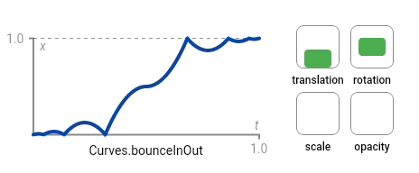</img>

 -->
## bounceInOut

## bounceIn
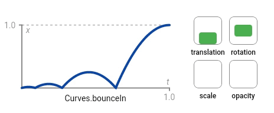
## bounceOut
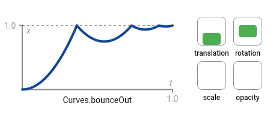
## decelerate
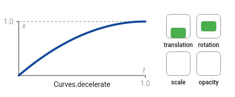
## easeInBack
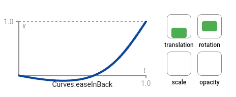
## easeInCirc
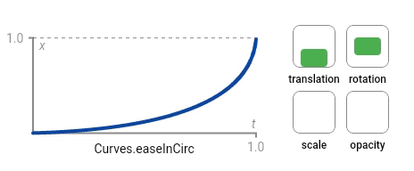
## easeInCubic
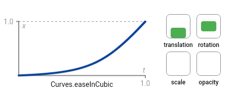
## easeInExpo
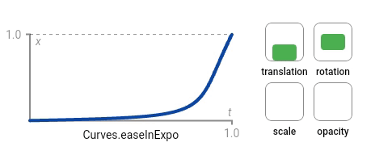
## easeInOutBack
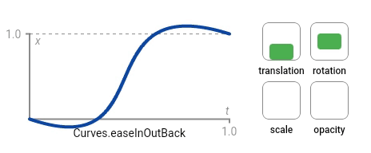
## easeInOutCirc
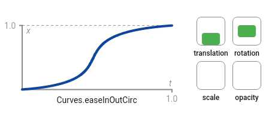
## easeInOutCubic

## easeInOutExpo
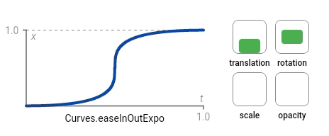
## easeInOutQuad
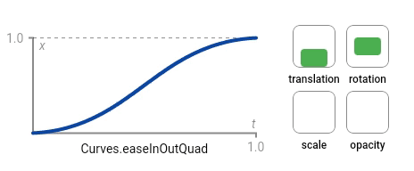
## easeInOutQuart
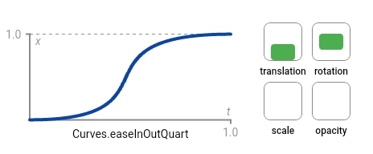
## easeInOutQuint
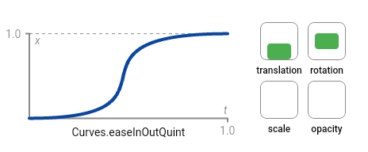
## easeInOutSine
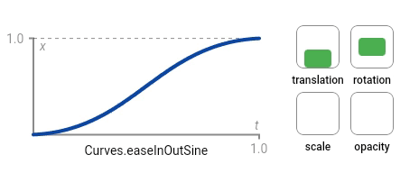
## easeInOut

## easeInQuad
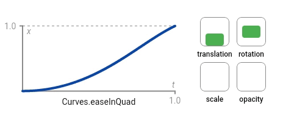
## easeInQuart
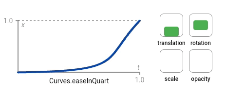
## easeInQuint
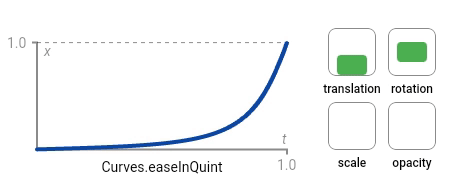
## easeInSine

## easeIn
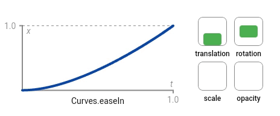
## easeOutBack
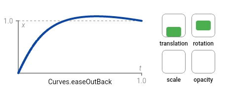
## easeOutCirc
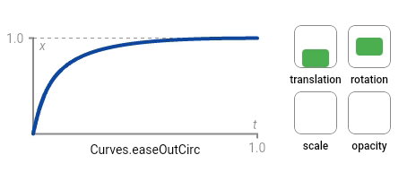
## easeOutCubic
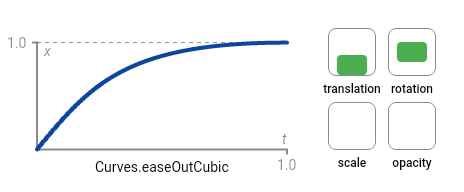
## easeOutExpo
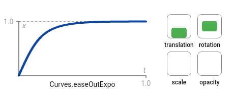
## easeOutQuad

## easeOutQuart
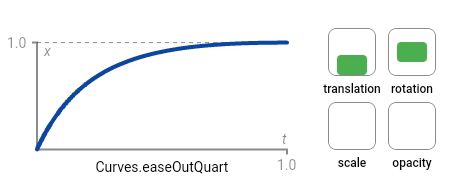
## easeOutQuint
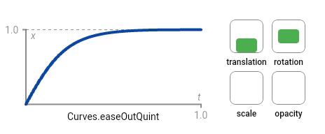
## easeOutSine
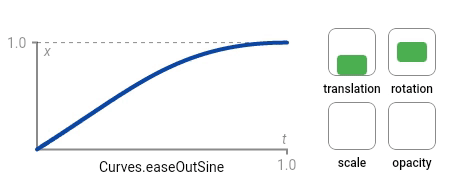
## easeOut
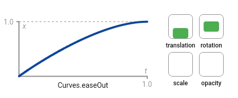
## ease
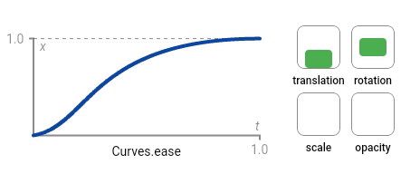
## elasticInOut
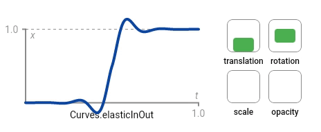
## elasticIn
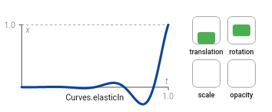
## elasticOut
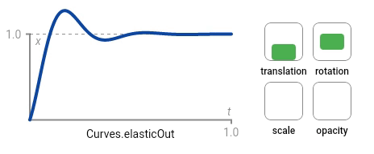
## fastOutSlowIn
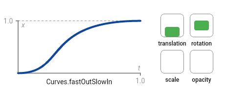
## linear
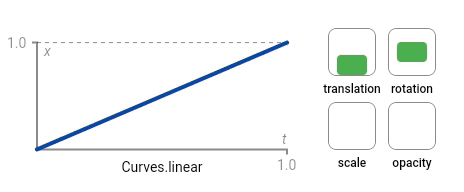
## slowMiddle
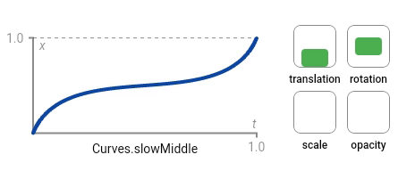