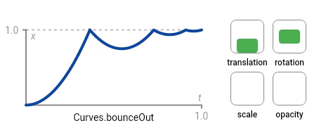

# 动画 _Motion_

参考 https://animejs.com/documentation/

## 补间动画 _MotionTween_

### 描述

产生在两个值之间的补间值，可选使用运动曲线，
`MotionTween` 是创建动作时最常用的动画构件之一。 </br>
`MotionTween` 可以为 `Point` ， `Size` ， `Rect` ， `double` 或 `Color` 类型的属性设置变化 </br>
属性将以 `duration` 为周期，从 `startVal` 值 变化到 `endVal` 值，
变化途中更新回调 `setter` [示例](./motion.md#示例)

### 参数

| 名称       | 参数类型                                    | 描述         |
| ----------| ------------------------------------------ | ------------ |
| setter    | `SetterCallback` | 属性更新的回调 |
| startVal  | `Point`  `Size`  `Rect`  `double`  `Color` | 属性开始的状态 |
| endVal    | `Point`  `Size`  `Rect`  `double`  `Color` | 属性结束的状态 |
| duration  | `double` | 动画持续时间(秒)   |
| curve  | `Curve` | 变化曲线 [查看预制](./curve.md)  |

### 示例

``` dart
var a = Offset(0.0, 0.0);
var b = Offset(100.0, 100.0);
// 节点从a点位置出发移动到b点位置结束
// 耗时两秒钟
var myTween = new MotionTween<Offset>(
    (p) => myNode.position = p, // 回调
    a,                          // 开始
    b,                          // 结束
    5.0,                        // 持续时间
    Curves.bounceOut            // 变化曲线
);
myNode.motions.run(myTween);
```

### 演示 

</img>
</img>

::: tip
 [下载示例](https://www.mdeditor.com/)
:::

## MotionSpline

``` dart
var mySpline = MotionSpline(
    (pos) => myNode.position = pos,
    [Offset(0, 500), Offset(500, 500), Offset(500, 0)],
    3,
    Curves.fastOutSlowIn
);
myNode.motions.run(mySpline);
```

* 动画
    - 补间动画
    - 样条曲线动画
    - 流程控制
        - 顺序
        - 组合
        - 延迟
        - 有限循环
        - 无限循环
    - 事件
        - 调用方法
        - 删除节点

## MotionSequence

``` dart
var mySequence = new MotionSequence([
    myMotion0,
    myMotion1,
    myMotion2,
]);
myNode.motions.run(mySequence);
```

## MotionRepeat

``` dart
var myLoop = new MotionRepeat(myMotion,10);
myNode.motions.run(myLoop);
```

## MotionRepeatForever

``` dart
var myInifiniteLoop = new MotionRepeatForever(myMotion);
myNode.motions.run(myInifiniteLoop);
```

## MotionRemoveNode

``` dart
var myMotion = new MotionRemoveNode(myNode);
myNode.motions.run(myMotion);
```

## MotionGroup

``` dart
var myGroup = new MotionGroup([myMotion0, myMotion1, myMotion2]);
myNode.motions.run(myGroup);
```

## MotionCallFunction

``` dart
var myMotion = new MotionCallFunction(() { ... });
myNode.motions.run(myMotion);
```

## MotionDelay

``` dart
var myMotion = MotionSequence([
  MotionDelay(2),
  MotionGroup([...]),
  MotionDelay(1),
  MotionCallFunction(() {...})
]);
myNode.motions.run(myMotion);
```
